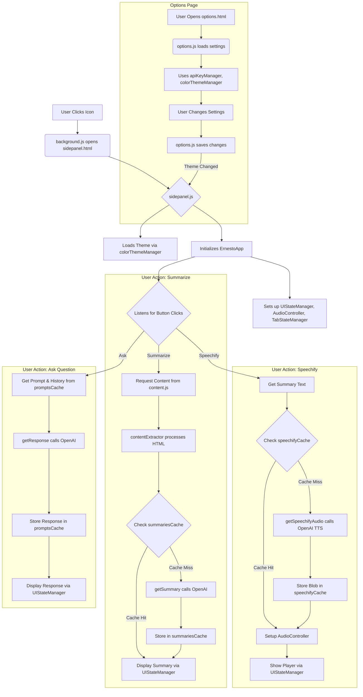

# Project Architecture

Concise overview of the Ernesto Chrome Extension structure for AI understanding.

## Core Components

### Side Panel (Main UI & Logic)

- `src/sidepanel/index.html`: Defines the structure of the extension's main user interface panel.
- `src/sidepanel/index.js`: Initializes the side panel UI, manages themes, and loads the main application controller (`ErnestoApp`).
- `src/core/ernestoApp.js`: Orchestrates core features like summarization, speech synthesis, and Q&A by coordinating UI, API calls, caching, and state management.
  - `ErnestoApp`: Main class handling UI events, tab state, and coordinating backend calls.
- `src/sidepanel/uiStateManager.js`: Manages the state and visibility of elements within `sidepanel.html`.
  - `UIStateManager`: Class providing methods to update UI elements based on application state.
- `src/common/ui/audioController.js`: Controls audio playback for the synthesized speech within the side panel.
  - `AudioController`: Class managing the `<audio>` element and playback states.

### Background Operations

- `src/background/index.js`: Service worker managing extension lifecycle events, side panel setup, background tasks (cache clearing), and theme migrations.
- `src/content/index.js`: Content script injected into pages to extract basic HTML and metadata upon request from other parts of the extension.

### API Interaction & Data Processing

- `src/common/api/getSummary.js`: Calls OpenAI API to generate summaries from page content.
- `src/common/api/getSpeechifyAudio.js`: Calls OpenAI API to convert text (summary) into speech audio.
- `src/common/api/getResponse.js`: Calls OpenAI API to answer user prompts based on page content and conversation history.
- `src/core/contentExtractor.js`: Processes raw HTML (using Readability.js or fallbacks) to extract the main content for analysis.

## Utility Components

### Caching

- `src/common/cache/genericCache.js`: Base class providing time-limited, storage-based caching functionality.
  - `GenericCache`: Implements core caching logic (TTL, get, set, clear, size).
- `src/common/cache/summariesCache.js`: Specializes `GenericCache` for storing page summaries keyed by URL.
- `src/common/cache/speechifyCache.js`: Specializes `GenericCache` for storing speech audio Blobs keyed by URL.
- `src/common/cache/promptsCache.js`: Specializes `GenericCache` for storing prompt conversation history keyed by URL.

### State & Settings Management

- `src/common/managers/tabStateManager.js`: Tracks the state (URL, title) associated with browser tabs.
  - `TabStateManager`: Manages tab state using a Map.
- `src/common/managers/apiKeyManager.js`: Securely stores and retrieves the OpenAI API key using encryption.
- `src/common/crypto/cryptoUtils.js`: Provides AES-GCM encryption/decryption utilities for sensitive data like the API key.
- `src/common/managers/colorThemeManager.js`: Manages default and domain-specific color themes, applying them via CSS variables.

### Options Page

- `src/options/index.html`: Defines the structure for the extension's settings page (API key, themes, cache).
- `src/options/index.js`: Handles logic for the options page: saving settings, managing themes, clearing caches, and updating UI.

## Configuration & Other Files

- `manifest.json`: Core Chrome Extension configuration file (permissions, scripts, icons, etc.).
- `public/icons/`: Contains extension icons (`icon16.png`, `icon48.png`, `icon128.png`).
- `src/vendor/`: Holds third-party libraries (Readability, Marked, DOMPurify, Turndown).
- `package.json` / `package-lock.json`: Node.js project configuration and dependency lock files.
- `vitest.setup.js`: Vitest global setup file.
- `vitest.config.js`: Vitest configuration file.
- `tests/`: Directory containing test files (e.g., `tests/unit/common/crypto/cryptoUtils.test.js`).
- `README.md`: Project documentation (setup, features).
- `ARCHITECTURE.md`: This file, outlining the project structure.
- `.gitignore`: Specifies files ignored by Git.
- `.cursor*`: Files/directories for the Cursor IDE.
- `library-test.html` / `library-test.js`: Test files for vendor libraries (consider moving to `tests/`).
- `src/sidepanel/libraries.js`: Loads/manages libraries for the side panel.

## Simplified Flow Overview

